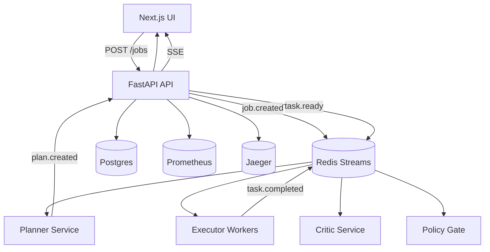

# agentic-planner-executor-platform

A user submits a Job with a Goal in a UI. A Planner creates a structured Plan with tasks, dependencies, and required tools. Executors pick up tasks, call tools when needed, update task status, and stream progress back to the UI in real time. Optionally, a Critic validates task outputs and can trigger rework. Optionally, a Policy Gate enforces allowed tools and guardrails per environment.

## Quickstart

```bash
make up
```

```bash
make test
```

```bash
make lint
```

## Architecture



## Example curl

Create a job:

```bash
curl -X POST http://localhost:8000/jobs \
  -H "Content-Type: application/json" \
  -d '{"goal":"Generate an implementation checklist for adding a new tool, then write a tools.md draft file as an artifact, then summarize it.","context_json":{},"priority":1}'
```

List tasks:

```bash
curl http://localhost:8000/jobs/<job_id>/tasks
```

## Demo flow

Default demo goal:

- Generate an implementation checklist for adding a new tool, then write a tools.md draft file as an artifact, then summarize it.

Planner tasks:
1. Create checklist (critic_required true)
2. Write artifact using file_write_artifact (critic_required true)
3. Summarize artifact using text_summarize (critic_required false)

Critic demo behavior: when CRITIC_ENABLED is true, the critic sometimes requests rework when outputs are missing.

Policy demo: when POLICY_MODE=prod and POLICY_GATE_ENABLED=true, attempts to use http_fetch are blocked with a policy reason.

## How to add a new tool

1. Add ToolSpec and handler in libs/core/tool_registry.py.
2. Add tests in services/worker/tests or libs/core/tests.
3. Update docs/tools.md with the new tool.

## Enable Critic loop

Set:

```
CRITIC_ENABLED=true
CRITIC_MAX_REWORKS=2
```

## Enable Policy Gate

Set:

```
POLICY_GATE_ENABLED=true
POLICY_MODE=prod
POLICY_CONFIG_PATH=config/policy.yaml
```

Edit config/policy.yaml to adjust allowlist and limits.

## Enable LLMPlanner

Set:

```
PLANNER_MODE=llm
LLM_PROVIDER=openai
OPENAI_API_KEY=your_key
```

Mock provider is used by default so the repo runs without external keys.

## Troubleshooting

- If Redis streams are empty, ensure redis is running and the services are connected.
- If SSE events are not visible, verify the API is reachable at http://localhost:8000.
- If Postgres migrations fail, confirm DATABASE_URL and run alembic upgrade head.
