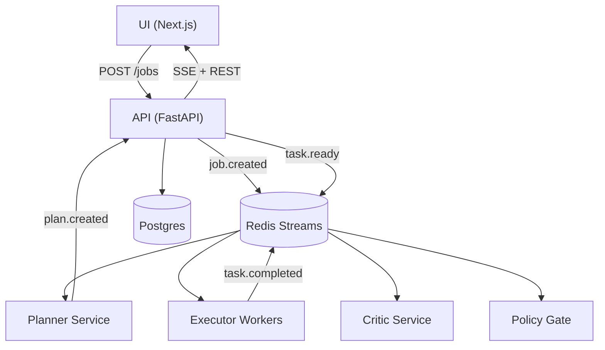

# Goal-Driven Agentic Workflow Engine (AWE)

AWE is a multi-service agentic platform for turning a user goal into an executable plan, running tool-backed tasks, and streaming progress/results to a UI.

## Agentic Pattern

This project uses a hierarchical **plan-and-execute** pattern:

1. **Planner** creates a typed task DAG from a goal.
2. **Worker executors** run ready tasks with tool calls (including MCP-backed services).
3. **Critic/Policy** optionally enforce quality and guardrails.
4. **API/UI** expose job state, task outputs, streaming events, and downloadable artifacts.

Operationally this is a control-plane/data-plane split with shared job context and task output handoff.

## Architecture



If your Markdown viewer does not support Mermaid, use this fallback:

```text
UI (Next.js) -> API (FastAPI) -> Redis Streams -> Planner
                               -> Redis Streams -> Worker
Worker -> Redis Streams
Redis Streams -> Critic
Redis Streams -> Policy
API -> UI (SSE + REST)
API -> Postgres
```

## Services

- `api`: job/task APIs, SSE stream, artifact/workspace download endpoints
- `planner`: goal -> plan DAG generation
- `worker`: task execution, retries, DLQ, tool orchestration
- `coder`: code-centric tool service (MCP)
- `tailor`: resume/document tailoring service (MCP)
- `policy`: policy gate checks
- `critic`: optional rework checks
- `ui`: Next.js frontend

## Tooling Architecture

Tool registration is centralized in `libs/core/tool_registry.py`, but implementation is now split by concern:

- `libs/framework/tool_runtime.py`: shared tool execution runtime (schema validation, timeout, error classification)
- `libs/tools/core_ops.py`: filesystem/workspace/search/render/core utility tools
- `libs/tools/llm_tool_groups.py`: grouped LLM tool registration specs
- `libs/tools/document_spec_llm.py`: DocumentSpec generation/repair/improvement tools
- `libs/tools/document_spec_iterative.py`: iterative DocumentSpec generation loops
- `libs/tools/openapi_iterative.py`: iterative OpenAPI spec generation loops
- `libs/tools/mcp_client.py`: MCP transport, retry, timeout budget, process/thread isolation
- `libs/tools/resume_llm.py`: resume/cover-letter/tailor LLM logic and shaping policies
- `libs/tools/coder_tools.py`: coding-agent request/plan/step execution logic

This keeps `tool_registry` focused on wiring and composition while tool families evolve independently.

## Local Development (Docker Compose)

1. Create local env from template.

```bash
cp .env.example .env
```

2. Start the stack.

```bash
make up
```

3. Access services.

- UI: `http://localhost:3002`
- API: `http://localhost:18000`

4. Run quality checks.

```bash
make test
make lint
make typecheck
```

## Configuration

- Non-secret runtime variables are documented in `.env.example`.
- Keep secrets in `.env` only.
- Typical secrets:
  - `OPENAI_API_KEY`
  - `GITHUB_TOKEN`
  - `AWS_ACCESS_KEY_ID`
  - `AWS_SECRET_ACCESS_KEY`

## Key Make Targets

- `make up` / `make down`
- `make images-list`
- `make images-build`
- `make images-push`
- `make k8s-up-local`
- `make k8s-apply-local`
- `make k8s-down-local`
- `make k8s-sync-workspace`
- `make k8s-sync-artifacts`
- `make k8s-sync-shared`

## Kubernetes

Kubernetes manifests live under `deploy/k8s`.

- Baseline deployments/services for app + data services
- HPA for `api`, `coder`, and `tailor`
- Optional KEDA scaler for worker queue depth
- Optional observability stack (Prometheus/Grafana/Loki/Jaeger)

See full deployment details in `deploy/k8s/README.md`.

### Local Kubernetes quickstart (Docker Desktop)

```bash
kubectl config use-context docker-desktop
make k8s-up-local
```

This builds and pushes local images to `localhost:5001`, applies local overlay manifests, and rolls deployments.

### Port forwarding

Use the command set in `docs/k8s-port-forward.md`.

Common forwards:

```bash
kubectl port-forward -n awe svc/api 18000:8000
kubectl port-forward -n awe svc/ui 8510:80
kubectl port-forward -n awe svc/grafana 3000:3000
kubectl port-forward -n awe svc/jaeger 16686:16686
```

## Worker Reliability and Scaling

Workers consume `task.ready` from Redis Streams consumer group `workers`.

- Retry policy: `WORKER_RETRY_POLICY=transient|any|none`
- Stale pending recovery: `WORKER_RECOVER_*`
- Dead-letter stream: `tasks.dlq` when `WORKER_DLQ_ENABLED=true`
- Retry failed tasks: `POST /jobs/{job_id}/tasks/{task_id}/retry`
- Retry all failed tasks: `POST /jobs/{job_id}/retry_failed`

## Artifact and Document Storage

### Filesystem mode

- `DOCUMENT_STORE_BACKEND=filesystem`
- Files are served from `ARTIFACTS_DIR` (default `/shared/artifacts`)

### S3/object store mode

- `DOCUMENT_STORE_BACKEND=s3`
- Required: `DOCUMENT_STORE_S3_BUCKET`
- Optional: `DOCUMENT_STORE_S3_PREFIX`, `DOCUMENT_STORE_S3_ENDPOINT`, `DOCUMENT_STORE_S3_REGION`

In S3 mode, workers upload artifacts and API download falls back to object store if local file is not found.

Download endpoints:

- `GET /artifacts/download?path=<relative_path>`
- `GET /workspace/download?path=<relative_path>`

## Observability

- Metrics: `/metrics` exposed by API
- Tracing: OTEL endpoint via `OTEL_EXPORTER_OTLP_ENDPOINT`
- Optional k8s observability stack via:

```bash
make k8s-apply-observability
```

## API Quick Reference

Create a job:

```bash
curl -X POST http://localhost:18000/jobs \
  -H "Content-Type: application/json" \
  -d '{"goal":"Generate an implementation checklist and artifact summary","context_json":{},"priority":1}'
```

List jobs:

```bash
curl http://localhost:18000/jobs
```

Job details:

```bash
curl http://localhost:18000/jobs/<job_id>/details
```

List tasks:

```bash
curl http://localhost:18000/jobs/<job_id>/tasks
```

Replan:

```bash
curl -X POST http://localhost:18000/jobs/<job_id>/replan
```

## LLM Planner and Worker Modes

Set these in `.env`:

```bash
PLANNER_MODE=llm
WORKER_MODE=llm
LLM_PROVIDER=openai
OPENAI_MODEL=<model>
OPENAI_API_KEY=<key>
OPENAI_BASE_URL=https://api.openai.com
OPENAI_TIMEOUT_S=60
OPENAI_MAX_RETRIES=2
```

If `LLM_PROVIDER` is left as `mock`, external keys are not required.

## Tailor Evaluator (Independent Scoring)

Tailor scoring can be independent of generation:

```bash
TAILOR_EVAL_MODE=llm        # llm | heuristic | self
TAILOR_EVAL_PROVIDER=openai
TAILOR_EVAL_OPENAI_MODEL=<model>
TAILOR_EVAL_OPENAI_TIMEOUT_S=15
TAILOR_EVAL_OPENAI_MAX_RETRIES=1
```

## Add a New Tool

1. Add `ToolSpec` + handler in `libs/core/tool_registry.py`.
2. Add/update tests in `libs/core/tests` and/or service tests.
3. Wire tool usage into planner/task flow as needed.
4. Update docs.

## Troubleshooting

- If UI shows connection errors, verify API forward is active on `localhost:18000`.
- If artifact download returns not found, confirm file exists under API-visible artifact root.
- If pods are `ImagePullBackOff`, confirm image tags/registry and rollout.
- If planner/worker behavior differs after env changes, run env setup and restart deployments.
