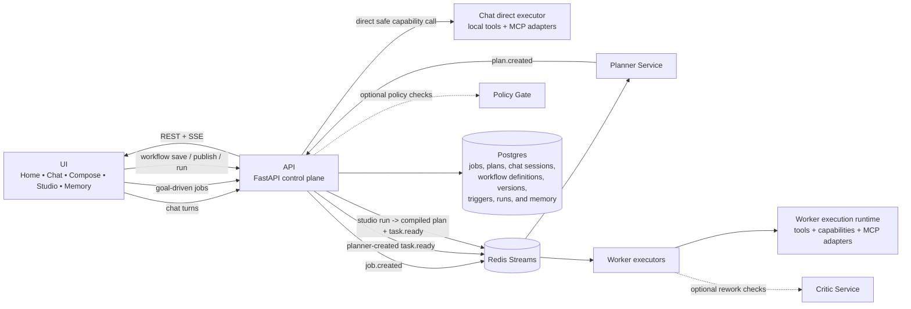

# Agentic Workflow Studio

Agentic Workflow Studio is a full-stack platform for authoring and running AI-powered workflows through chat and a visual DAG editor, backed by typed execution contracts, reusable capabilities, memory, triggers, and Kubernetes-native orchestration.

## Agentic Pattern

This project uses a hybrid **agentic execution** pattern with three execution lanes:

1. **Planner-led jobs**: the planner creates a typed task DAG from a goal for goal-driven work.
2. **Direct chat execution**: chat can answer normally or invoke a single safe read-only capability when no durable workflow is needed.
3. **Studio-authored workflows**: manually designed workflow versions and triggers compile and run directly without planner involvement.
4. **Worker executors** run ready tasks with tool calls and capability adapters (including MCP-backed services).
5. **Critic/Policy** optionally enforce quality and guardrails.
6. **API/UI** expose job state, workflow runs, task outputs, streaming events, and downloadable artifacts.

Operationally this is a control-plane/data-plane split with typed contracts, shared job context, and task output handoff across planner, chat, and workflow-studio paths.

## Architecture

The platform has three user-facing execution paths that converge on shared runtime and storage services:

- **Chat path**: stays conversational by default, or executes one safe read-only capability directly when no durable workflow is needed.
- **Planner-led path**: accepts a goal, emits `job.created`, lets the planner build a task DAG, and dispatches ready tasks to workers.
- **Studio path**: saves and publishes manually authored workflow versions, then runs them directly through triggers or `Run Workflow` without planner involvement.


```mermaid
flowchart LR
  UI["UI<br/>Home • Chat • Compose • Studio • Memory"] -->|"chat turns"| API["API<br/>FastAPI control plane"]
  UI -->|"goal-driven jobs"| API
  UI -->|"workflow save / publish / run"| API

  API -->|"direct safe capability call"| CHAT["Chat direct executor<br/>local tools + MCP adapters"]

  API -->|"job.created"| REDIS[("Redis Streams")]
  REDIS --> PLANNER["Planner Service"]
  PLANNER -->|"plan.created"| API

  API -->|"planner-created task.ready"| REDIS
  API -->|"studio run -> compiled plan + task.ready"| REDIS
  REDIS --> WORKER["Worker executors"]
  WORKER --> EXEC["Worker execution runtime<br/>tools + capabilities + MCP adapters"]

  API -. "optional policy checks" .-> POLICY["Policy Gate"]
  WORKER -. "optional rework checks" .-> CRITIC["Critic Service"]

  API --> DB[("Postgres<br/>jobs, plans, chat sessions,<br/>workflow definitions, versions,<br/>triggers, runs, and memory")]
  API -->|"REST + SSE"| UI
```

If your Markdown viewer does not support Mermaid, use this fallback:

```text
UI -> API
  - chat turns can stay conversational or execute one safe read-only capability directly in the API
  - goal-driven jobs emit job.created to Redis, then Planner returns a typed plan to the API
  - Studio workflow versions and triggers run directly from the API without planner involvement

API -> Redis Streams -> Worker executors
API -> Postgres (jobs, plans, chat sessions, workflow definitions, versions, triggers, runs, memory)
API -> UI (REST + SSE)
Planner -> API
Policy and Critic are optional guardrail/rework services
```

## Application Services

- `api`: control plane for chat, jobs, plans, workflow definitions/versions/triggers/runs, memory APIs, downloads, and SSE
- `planner`: builds typed task DAGs for planner-led jobs
- `worker`: executes ready tasks through tool and capability runtimes, including memory-aware payload resolution
- `policy`: optional policy gate service
- `critic`: optional rework/review service
- `ui`: Next.js frontend for Home, Chat, Compose, Studio, and Memory

## Tooling Architecture

Tool assembly is coordinated through `libs/core/tool_bootstrap.py`, with responsibilities split by concern:

- `libs/core/tool_bootstrap.py`: builds service-specific tool registries from catalog, plugins, and governance rules
- `libs/core/tool_catalog.py`: built-in tool catalog and handler registration
- `libs/core/tool_plugins.py`: dynamic plugin discovery and loading
- `libs/core/tool_governance.py`: tool allowlists and governance enforcement
- `libs/core/tool_registry.py`: compatibility layer and default handler wiring
- `libs/framework/tool_runtime.py`: shared tool execution runtime (schema validation, timeout, error classification)
- `libs/tools/core_ops.py`: filesystem/workspace/search/render/core utility tools
- `libs/tools/llm_tool_groups.py`: grouped LLM tool registration specs
- `libs/tools/document_spec_llm.py`: DocumentSpec generation/repair/improvement tools
- `libs/tools/document_spec_iterative.py`: iterative DocumentSpec generation loops
- `libs/tools/openapi_iterative.py`: iterative OpenAPI spec generation loops
- `libs/tools/mcp_client.py`: MCP transport, retry, timeout budget, process/thread isolation
- `libs/tools/coder_tools.py`: coding-agent request/plan/step execution logic

This keeps tool bootstrap, governance, plugin loading, and tool-family implementations separated while preserving a compatibility layer for existing call sites.

### Plug-and-Play Tool Loading

`tool_bootstrap.build_default_registry(...)` supports dynamic plugin loading and runtime tool filters:

- `TOOL_PLUGIN_MODULES`: comma-separated module specs loaded at startup.
  - Format: `module.path` (defaults to `register_tools`) or `module.path:callable_name`.
  - Callable contract: `register_tools(registry, ...)` (first arg must be registry).
- `TOOL_PLUGIN_DISCOVERY_ENABLED=true` enables Python entry-point discovery.
- `TOOL_PLUGIN_ENTRYPOINT_GROUP` sets the entry-point group (default: `awe.tools`).
- `TOOL_PLUGIN_FAIL_FAST=true|false` controls startup behavior on plugin load failure.
- `ENABLED_TOOLS`: optional allowlist of final tool names.
- `DISABLED_TOOLS`: optional denylist of final tool names.
- Per-service allow/deny:
  - `PLANNER_ENABLED_TOOLS` / `PLANNER_DISABLED_TOOLS`
  - `WORKER_ENABLED_TOOLS` / `WORKER_DISABLED_TOOLS`
  - `API_ENABLED_TOOLS` / `API_DISABLED_TOOLS`
  - Deny wins over allow.
- Governance policy config:
  - `TOOL_GOVERNANCE_ENABLED=true|false`
  - `TOOL_GOVERNANCE_MODE=enforce|dry_run`
  - `TOOL_GOVERNANCE_CONFIG_PATH=config/tool_governance.yaml`
  - Supports global/service/tenant/job_type rules and risk-level blocks.

Example:

```bash
TOOL_PLUGIN_MODULES=my_tools.my_plugin
ENABLED_TOOLS=llm_generate,my_custom_tool
DISABLED_TOOLS=sleep
WORKER_DISABLED_TOOLS=run_tests,workspace_write_code
```

In `dry_run`, violations are logged (`tool_governance_violation_dry_run`) but not blocked.

### Capability Governance and Contracts

Capability execution has separate controls so capabilities can be governed independently from local tools across worker execution and direct chat execution:

- `CAPABILITY_MODE=disabled|dry_run|enabled`
- `CAPABILITY_REGISTRY_PATH=config/capability_registry.yaml`
- `CAPABILITY_GOVERNANCE_ENABLED=true|false`
- `CAPABILITY_GOVERNANCE_MODE=enforce|dry_run`
- `ENABLED_CAPABILITIES` / `DISABLED_CAPABILITIES`
- Per-service allow/deny:
  - `WORKER_ENABLED_CAPABILITIES` / `WORKER_DISABLED_CAPABILITIES`
  - `API_ENABLED_CAPABILITIES` / `API_DISABLED_CAPABILITIES`
  - other normalized service names follow the same pattern
- Runtime input contract enforcement:
  - `CAPABILITY_INPUT_VALIDATION_ENABLED=true|false`
  - `CAPABILITY_ENFORCE_SCHEMA_PROPERTIES=true|false`

When enabled, capability payloads are validated against the capability input schema and can be pruned to declared top-level properties before execution.
In `dry_run`, capability violations are logged (`capability_governance_violation_dry_run`) and execution continues.

In-repo template:

- `plugins/example_tool_plugin.py`
- load with `TOOL_PLUGIN_MODULES=plugins.example_tool_plugin`

## Local Development (Docker Compose)

Prerequisites:

- Docker Desktop or Docker Engine with Docker Compose
- `uv` for host-side quality checks (`make test`, `make lint`, `make typecheck`, eval targets)

1. Create local env from template and set required OpenAI credentials.

```bash
cp .env.example .env
```

Set at minimum:

```bash
OPENAI_API_KEY=<your-key>
OPENAI_MODEL=<your-model>
```

Optional for Kubernetes or custom local setups that enable GitHub capabilities:

```bash
GITHUB_CLASSIC_TOKEN=<your-token>
```

Docker Compose runs the planner and worker in OpenAI-backed LLM mode, so these credentials are required for a functional local stack.
GitHub capabilities are not part of the default Docker Compose workflow because the Compose stack does not include `github-mcp`.

2. Start the stack.

```bash
make up
```

3. Access services.

- UI: `http://localhost:3002`
- API: `http://localhost:18000`

4. Run quality checks.

```bash
make test
make lint
make typecheck
make eval-intent
```

These Make targets now run through `uv`, so you do not need to preinstall `pytest`, `ruff`, `mypy`, or the Python runtime dependencies manually.

## Configuration

- Non-secret runtime variables are documented in `.env.example`.
- Keep secrets in `.env` only.
- Common non-secret configuration:
  - `OPENAI_MODEL`
  - `OPENAI_BASE_URL`
  - `PLANNER_MODE`
  - `WORKER_MODE`
  - `NEXT_PUBLIC_API_URL`
- Typical secrets:
  - `OPENAI_API_KEY`
  - `GITHUB_CLASSIC_TOKEN` preferred, with fallback to `GITHUB_TOKEN`
  - `AWS_ACCESS_KEY_ID`
  - `AWS_SECRET_ACCESS_KEY`

## Key Make Targets

- `make up` / `make down`
- `make up-workers`
- `make test`
- `make lint`
- `make typecheck`
- `make format`
- `make schemas`
- `make images-list`
- `make images-build`
- `make images-push`
- `make eval-intent`
- `make eval-intent-gate`
- `make eval-capability-search`
- `make eval-capability-search-gate`
- `make k8s-up-local`
- `make k8s-apply-local`
- `make k8s-down-local`
- `make k8s-restart-local`
- `make k8s-sync-workspace`
- `make k8s-sync-artifacts`
- `make k8s-sync-shared`

## Intent Eval Harness

Use the gold-set harness to track intent decomposition quality over time.

Gold cases:

- `eval/intent_gold.yaml`

Run locally:

```bash
make eval-intent
```

CI gate (thresholded):

```bash
make eval-intent-gate
```

The Make targets above are the recommended path because they wrap the required dependencies with `uv`.

## Kubernetes

Kubernetes manifests live under `deploy/k8s`.

- Baseline deployments/services for app + data services
- Optional KEDA scaler for worker queue depth
- Optional observability stack (Prometheus/Grafana/Loki/Jaeger)

See full deployment details in `deploy/k8s/README.md`.

### Local Kubernetes quickstart (Docker Desktop)

```bash
kubectl config use-context docker-desktop
make k8s-up-local
```

This builds and pushes local images to `localhost:5001`, applies the local overlay manifests, syncs `.env`-backed config/secrets into the cluster, and rolls the application deployments.

Useful follow-up targets:

- `make k8s-apply-local`: reapply the local overlay and refresh cluster env/config from `.env`
- `make k8s-restart-local`: restart the deployed application workloads after env/config changes
- `make k8s-down-local`: tear down local app deployments while keeping persistent data
- `make k8s-sync-workspace` / `make k8s-sync-artifacts` / `make k8s-sync-shared`: copy shared files back to the local checkout

### Port forwarding

Use the command set in `docs/k8s-port-forward.md`.

Common forwards:

```bash
kubectl port-forward -n awe svc/api 18000:8000
kubectl port-forward -n awe svc/ui 8510:80
kubectl port-forward -n awe svc/coder 18001:8000
kubectl port-forward -n awe svc/grafana 3000:3000
kubectl port-forward -n awe svc/jaeger 16686:16686
kubectl port-forward -n awe svc/prometheus 9090:9090
```

## Guides

- [User Guide](docs/user-guide.md)
- [API Guide](docs/api.md)
- [Architecture](docs/architecture.md)
- [AI Agents as Capabilities](docs/agent-capabilities.md)
- [RAG Playbook](docs/rag-playbook.md)
- [Semantic Memory](docs/semantic-memory.md)

## Worker Reliability and Scaling

Workers consume `task.ready` from Redis Streams consumer group `workers`.

- Retry policy: `WORKER_RETRY_POLICY=transient|any|none`
- Stale pending recovery: `WORKER_RECOVER_*`
- Dead-letter stream: `tasks.dlq` when `WORKER_DLQ_ENABLED=true`
- Retry failed tasks: `POST /jobs/{job_id}/tasks/{task_id}/retry`
- Retry all failed tasks: `POST /jobs/{job_id}/retry_failed`
- Base Kubernetes scaling options:
  - CPU HPA: `deploy/k8s/hpa-worker.yaml`
  - Queue-depth autoscaling with KEDA: `deploy/k8s/keda-worker-scaledobject.yaml`
- Multi-worker filesystem execution expects shared storage that supports `ReadWriteMany` for the `shared-data` PVC.
- Queue-depth scaling follows Redis Stream backlog for `tasks.events` and consumer group `workers`.

## Artifact and Document Storage

### Filesystem mode

- `DOCUMENT_STORE_BACKEND=filesystem`
- Artifact files are written under `ARTIFACTS_DIR` (default `/shared/artifacts`)
- API artifact downloads in filesystem mode require the API service to have access to the same shared artifact volume
- The local Kubernetes overlay mounts `/shared` into both `worker` and `api`; the base Kubernetes manifests do not

### S3/object store mode

- `DOCUMENT_STORE_BACKEND=s3`
- Required: `DOCUMENT_STORE_S3_BUCKET`
- Optional: `DOCUMENT_STORE_S3_PREFIX`, `DOCUMENT_STORE_S3_ENDPOINT`, `DOCUMENT_STORE_S3_REGION`

In S3 mode, workers upload artifact files after generation and API artifact download falls back to object store if the local file is not found.

Artifact download endpoint:

- `GET /artifacts/download?path=<relative_path>`

Workspace download endpoint:

- `GET /workspace/download?path=<relative_path>`

`/workspace/download` is always served from shared workspace storage. It does not fall back to S3/object storage.

## Observability

- Metrics:
  - API exposes `/metrics`
  - Planner, worker, policy, and coder also expose Prometheus metrics endpoints in the deployed stack
- Tracing:
  - OTLP tracing is supported via `OTEL_EXPORTER_OTLP_ENDPOINT`
  - Worker currently configures OTLP trace export explicitly
  - Trace IDs are also surfaced through task/job runtime data and linked from the UI debugger
- Optional Kubernetes observability stack via `make k8s-apply-observability`:
  - Prometheus
  - Grafana
  - Loki
  - Prebuilt dashboards
- Jaeger is deployed separately in the base Kubernetes manifests and can be port-forwarded independently

```bash
make k8s-apply-observability
```

## API Quick Reference

Assume the API is available at `http://localhost:18000`.

### Jobs

Create a job:

```bash
curl -X POST http://localhost:18000/jobs \
  -H "Content-Type: application/json" \
  -d '{"goal":"Generate an implementation checklist and artifact summary","context_json":{},"priority":1}'
```

List jobs:

```bash
curl http://localhost:18000/jobs
```

Job details and tasks:

```bash
curl http://localhost:18000/jobs/<job_id>/details
curl http://localhost:18000/jobs/<job_id>/tasks
```

- `POST /jobs/{job_id}/replan`
- `POST /jobs/{job_id}/cancel`
- `POST /jobs/{job_id}/resume`
- `POST /jobs/{job_id}/retry`
- `POST /jobs/{job_id}/retry_failed`
- `POST /jobs/{job_id}/tasks/{task_id}/retry`
- `GET /jobs/{job_id}/debugger`
- `GET /jobs/{job_id}/tasks/dlq`
- `GET /artifacts/download?path=<relative_path>`

### Chat

Create a chat session:

```bash
curl -X POST http://localhost:18000/chat/sessions \
  -H "Content-Type: application/json" \
  -d '{"title":"Workspace assistant"}'
```

Send a chat turn:

```bash
curl -X POST http://localhost:18000/chat/sessions/<session_id>/messages \
  -H "Content-Type: application/json" \
  -d '{"content":"List the workspace files","context_json":{},"priority":0}'
```

- `GET /chat/sessions/{session_id}`

### Workflows

Create a workflow definition:

```bash
curl -X POST http://localhost:18000/workflows/definitions \
  -H "Content-Type: application/json" \
  -d '{"title":"Document pipeline","goal":"Generate and render a document","draft":{},"context_json":{},"user_id":"narendersurabhi"}'
```

Publish and run:

```bash
curl -X POST http://localhost:18000/workflows/definitions/<definition_id>/publish \
  -H "Content-Type: application/json" \
  -d '{}'

curl -X POST http://localhost:18000/workflows/versions/<version_id>/run \
  -H "Content-Type: application/json" \
  -d '{"inputs":{},"context_json":{},"priority":0}'
```

- `GET /workflows/definitions`
- `GET /workflows/definitions/{definition_id}`
- `PUT /workflows/definitions/{definition_id}`
- `GET /workflows/definitions/{definition_id}/versions`
- `POST /workflows/definitions/{definition_id}/triggers`
- `GET /workflows/definitions/{definition_id}/triggers`
- `PUT /workflows/triggers/{trigger_id}`
- `POST /workflows/triggers/{trigger_id}/invoke`
- `GET /workflows/definitions/{definition_id}/runs`

### Memory

Write a user profile entry:

```bash
curl -X POST http://localhost:18000/memory/write \
  -H "Content-Type: application/json" \
  -d '{"name":"user_profile","scope":"user","user_id":"narendersurabhi","key":"profile","payload":{"full_name":"Narender Rao Surabhi"},"metadata":{"source":"manual"}}'
```

Read and semantic-search memory:

```bash
curl "http://localhost:18000/memory/read?name=user_profile&scope=user&user_id=narendersurabhi&key=profile"

curl -X POST http://localhost:18000/memory/semantic/search \
  -H "Content-Type: application/json" \
  -d '{"query":"education and certifications","namespace":"resume_profile","user_id":"narendersurabhi"}'
```

- `GET /memory/specs`
- `DELETE /memory/delete?...`
- `POST /memory/semantic/write`

### Composer and Capabilities

Compile a Studio/composer draft:

```bash
curl -X POST http://localhost:18000/composer/compile \
  -H "Content-Type: application/json" \
  -d '{"draft":{"goal":"Draft workflow","nodes":[],"edges":[]}}'
```

- `POST /composer/recommend_capabilities`
- `GET /capabilities`
- `POST /capabilities/search`
- `POST /intent/clarify`
- `POST /intent/decompose`
- `POST /plans/preflight`

## LLM Planner and Worker Modes

Docker Compose runs planner and worker in OpenAI-backed LLM mode. Before `make up`, set the OpenAI values consumed by the Compose file:

```bash
OPENAI_MODEL=<model>
OPENAI_API_KEY=<key>
OPENAI_BASE_URL=https://api.openai.com
OPENAI_TEMPERATURE=
OPENAI_MAX_OUTPUT_TOKENS=
OPENAI_TIMEOUT_S=60
OPENAI_MAX_RETRIES=2
```

In Docker Compose, `planner` and `worker` modes are fixed by `docker-compose.yml` as `PLANNER_MODE=llm`, `WORKER_MODE=llm`, and `LLM_PROVIDER=openai`.

If you are not using Docker Compose and want a reduced local path for isolated development, you can still run individual services or tests in mock/rule-based modes explicitly through environment overrides.

## Add a New Tool

1. Implement your tool module with `register_tools(registry, ...)`.
2. Register one or more `Tool` objects with `ToolSpec` + handler.
3. Load it through `tool_bootstrap.build_default_registry(...)` via `TOOL_PLUGIN_MODULES` (or entry points).
4. Verify service-level governance and allowlists so the new tool is visible where you expect it to run.
5. If the tool should be planner/chat/studio addressable as a capability, add or update its capability definition and schema refs in `config/capability_registry.yaml`.
6. Add/update tests in `libs/core/tests` and/or service tests.
7. Update planner prompts/tool usage guidance only if needed.

## Troubleshooting

- If UI shows connection errors, verify the API forward is active on `localhost:18000` and the UI forward is active on your chosen local port. See `docs/k8s-port-forward.md`.
- If artifact download returns not found, confirm whether you are using shared-filesystem mode or S3/object-store fallback, and verify the file is visible to the API in the configured storage mode.
- If pods are `ImagePullBackOff` in local Kubernetes, use a fixed image tag, re-pin images, and restart rollouts. See `docs/runbook.md`.
- If planner/worker behavior differs after env changes, re-sync config/secrets and restart deployments with `make k8s-apply-local` or `make k8s-restart-local`.
