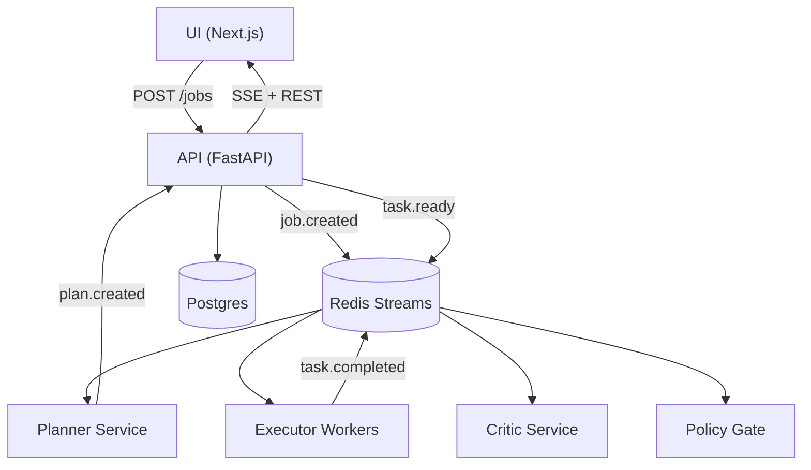

# Agentic Workflow Studio

Agentic Workflow Studio is a full-stack planner-executor workflow platform for authoring and executing AI-powered workflows through chat, structured job composition, and a visual DAG editor. It uses typed planner-worker contracts, reusable capabilities, memory, triggers, and Kubernetes runtime orchestration.

## Agentic Pattern

This project uses a hierarchical **plan-and-execute** pattern:

1. **Planner** creates a typed task DAG from a goal.
2. **Worker executors** run ready tasks with tool calls (including MCP-backed services).
3. **Critic/Policy** optionally enforce quality and guardrails.
4. **API/UI** expose job state, task outputs, streaming events, and downloadable artifacts.

Operationally this is a control-plane/data-plane split with shared job context and task output handoff.

## Architecture


```mermaid
flowchart TD
  UI["UI (Next.js)"] -->|"POST /jobs"| API["API (FastAPI)"]
  API -->|"job.created"| REDIS[("Redis Streams")]
  REDIS --> PLANNER["Planner Service"]
  PLANNER -->|"plan.created"| API
  API -->|"task.ready"| REDIS
  REDIS --> WORKER["Executor Workers"]
  WORKER -->|"task.completed"| REDIS
  REDIS --> CRITIC["Critic Service"]
  REDIS --> POLICY["Policy Gate"]
  API -->|"SSE + REST"| UI
  API --> PG[("Postgres")]
```

If your Markdown viewer does not support Mermaid, use this fallback:

```text
UI (Next.js) -> API (FastAPI) -> Redis Streams -> Planner
                               -> Redis Streams -> Worker
Worker -> Redis Streams
Redis Streams -> Critic
Redis Streams -> Policy
API -> UI (SSE + REST)
API -> Postgres
```

## Services

- `api`: job/task APIs, SSE stream, artifact/workspace download endpoints
- `planner`: goal -> plan DAG generation
- `worker`: task execution, retries, DLQ, tool orchestration
- `coder`: code-centric tool service (MCP)
- `policy`: policy gate checks
- `critic`: optional rework checks
- `ui`: Next.js frontend

## Tooling Architecture

Tool registration is centralized in `libs/core/tool_registry.py`, but implementation is now split by concern:

- `libs/framework/tool_runtime.py`: shared tool execution runtime (schema validation, timeout, error classification)
- `libs/tools/core_ops.py`: filesystem/workspace/search/render/core utility tools
- `libs/tools/llm_tool_groups.py`: grouped LLM tool registration specs
- `libs/tools/document_spec_llm.py`: DocumentSpec generation/repair/improvement tools
- `libs/tools/document_spec_iterative.py`: iterative DocumentSpec generation loops
- `libs/tools/openapi_iterative.py`: iterative OpenAPI spec generation loops
- `libs/tools/mcp_client.py`: MCP transport, retry, timeout budget, process/thread isolation
- `libs/tools/coder_tools.py`: coding-agent request/plan/step execution logic

This keeps `tool_registry` focused on wiring and composition while tool families evolve independently.

### Plug-and-Play Tool Loading

`default_registry()` now supports dynamic plugin loading and runtime tool filters:

- `TOOL_PLUGIN_MODULES`: comma-separated module specs loaded at startup.
  - Format: `module.path` (defaults to `register_tools`) or `module.path:callable_name`.
  - Callable contract: `register_tools(registry, ...)` (first arg must be registry).
- `TOOL_PLUGIN_DISCOVERY_ENABLED=true` enables Python entry-point discovery.
- `TOOL_PLUGIN_ENTRYPOINT_GROUP` sets the entry-point group (default: `awe.tools`).
- `TOOL_PLUGIN_FAIL_FAST=true|false` controls startup behavior on plugin load failure.
- `ENABLED_TOOLS`: optional allowlist of final tool names.
- `DISABLED_TOOLS`: optional denylist of final tool names.
- Per-service allow/deny:
  - `PLANNER_ENABLED_TOOLS` / `PLANNER_DISABLED_TOOLS`
  - `WORKER_ENABLED_TOOLS` / `WORKER_DISABLED_TOOLS`
  - `API_ENABLED_TOOLS` / `API_DISABLED_TOOLS`
  - Deny wins over allow.
- Governance policy config:
  - `TOOL_GOVERNANCE_ENABLED=true|false`
  - `TOOL_GOVERNANCE_MODE=enforce|dry_run`
  - `TOOL_GOVERNANCE_CONFIG_PATH=config/tool_governance.yaml`
  - Supports global/service/tenant/job_type rules and risk-level blocks.

Example:

```bash
TOOL_PLUGIN_MODULES=my_tools.my_plugin
ENABLED_TOOLS=llm_generate,my_custom_tool
DISABLED_TOOLS=sleep
WORKER_DISABLED_TOOLS=run_tests,workspace_write_code
```

In `dry_run`, violations are logged (`tool_governance_violation_dry_run`) but not blocked.

### Capability Governance and Contracts

Capability execution has separate controls so planner-selected capabilities can be governed independently from local tools:

- `CAPABILITY_MODE=disabled|dry_run|enabled`
- `CAPABILITY_REGISTRY_PATH=config/capability_registry.yaml`
- `CAPABILITY_GOVERNANCE_ENABLED=true|false`
- `CAPABILITY_GOVERNANCE_MODE=enforce|dry_run`
- `ENABLED_CAPABILITIES` / `DISABLED_CAPABILITIES`
- Per-service allow/deny (for worker runtime):
  - `WORKER_ENABLED_CAPABILITIES` / `WORKER_DISABLED_CAPABILITIES`
- Runtime input contract enforcement:
  - `CAPABILITY_INPUT_VALIDATION_ENABLED=true|false`
  - `CAPABILITY_ENFORCE_SCHEMA_PROPERTIES=true|false`

When enabled, worker validates capability payloads against the capability input schema and can prune out undeclared top-level keys before execution.
In `dry_run`, capability violations are logged (`capability_governance_violation_dry_run`) and execution continues.

In-repo template:

- `plugins/example_tool_plugin.py`
- load with `TOOL_PLUGIN_MODULES=plugins.example_tool_plugin`

## Local Development (Docker Compose)

1. Create local env from template.

```bash
cp .env.example .env
```

2. Start the stack.

```bash
make up
```

3. Access services.

- UI: `http://localhost:3002`
- API: `http://localhost:18000`

4. Run quality checks.

```bash
make test
make lint
make typecheck
make eval-intent
```

## Configuration

- Non-secret runtime variables are documented in `.env.example`.
- Keep secrets in `.env` only.
- Typical secrets:
  - `OPENAI_API_KEY`
  - `GITHUB_CLASSIC_TOKEN` or `GITHUB_TOKEN`
  - `AWS_ACCESS_KEY_ID`
  - `AWS_SECRET_ACCESS_KEY`

## Key Make Targets

- `make up` / `make down`
- `make images-list`
- `make images-build`
- `make images-push`
- `make eval-intent`
- `make k8s-up-local`
- `make k8s-apply-local`
- `make k8s-down-local`
- `make k8s-sync-workspace`
- `make k8s-sync-artifacts`
- `make k8s-sync-shared`

## Intent Eval Harness

Use the gold-set harness to track intent decomposition quality over time.

Gold cases:

- `eval/intent_gold.yaml`

Run locally:

```bash
make eval-intent
```

CI gate (thresholded):

```bash
make eval-intent-gate
```

Direct script usage:

```bash
PYTHONPATH=. python3 scripts/eval_intent_decompose.py \
  --gold eval/intent_gold.yaml \
  --mode heuristic \
  --top-k 3 \
  --verbose
```

Optional gates:

```bash
PYTHONPATH=. python3 scripts/eval_intent_decompose.py \
  --min-intent-f1 0.80 \
  --min-capability-f1 0.60 \
  --min-segment-hit-rate 0.30
```

## Kubernetes

Kubernetes manifests live under `deploy/k8s`.

- Baseline deployments/services for app + data services
- Optional KEDA scaler for worker queue depth
- Optional observability stack (Prometheus/Grafana/Loki/Jaeger)

See full deployment details in `deploy/k8s/README.md`.

### Local Kubernetes quickstart (Docker Desktop)

```bash
kubectl config use-context docker-desktop
make k8s-up-local
```

This builds and pushes local images to `localhost:5001`, applies local overlay manifests, and rolls deployments.

### Port forwarding

Use the command set in `docs/k8s-port-forward.md`.

Common forwards:

```bash
kubectl port-forward -n awe svc/api 18000:8000
kubectl port-forward -n awe svc/ui 8510:80
kubectl port-forward -n awe svc/grafana 3000:3000
kubectl port-forward -n awe svc/jaeger 16686:16686
```

## Worker Reliability and Scaling

Workers consume `task.ready` from Redis Streams consumer group `workers`.

- Retry policy: `WORKER_RETRY_POLICY=transient|any|none`
- Stale pending recovery: `WORKER_RECOVER_*`
- Dead-letter stream: `tasks.dlq` when `WORKER_DLQ_ENABLED=true`
- Retry failed tasks: `POST /jobs/{job_id}/tasks/{task_id}/retry`
- Retry all failed tasks: `POST /jobs/{job_id}/retry_failed`

## Artifact and Document Storage

### Filesystem mode

- `DOCUMENT_STORE_BACKEND=filesystem`
- Files are served from `ARTIFACTS_DIR` (default `/shared/artifacts`)

### S3/object store mode

- `DOCUMENT_STORE_BACKEND=s3`
- Required: `DOCUMENT_STORE_S3_BUCKET`
- Optional: `DOCUMENT_STORE_S3_PREFIX`, `DOCUMENT_STORE_S3_ENDPOINT`, `DOCUMENT_STORE_S3_REGION`

In S3 mode, workers upload artifacts and API download falls back to object store if local file is not found.

Download endpoints:

- `GET /artifacts/download?path=<relative_path>`
- `GET /workspace/download?path=<relative_path>`

## Observability

- Metrics: `/metrics` exposed by API
- Tracing: OTEL endpoint via `OTEL_EXPORTER_OTLP_ENDPOINT`
- Optional k8s observability stack via:

```bash
make k8s-apply-observability
```

## API Quick Reference

Create a job:

```bash
curl -X POST http://localhost:18000/jobs \
  -H "Content-Type: application/json" \
  -d '{"goal":"Generate an implementation checklist and artifact summary","context_json":{},"priority":1}'
```

List jobs:

```bash
curl http://localhost:18000/jobs
```

Job details:

```bash
curl http://localhost:18000/jobs/<job_id>/details
```

List tasks:

```bash
curl http://localhost:18000/jobs/<job_id>/tasks
```

Replan:

```bash
curl -X POST http://localhost:18000/jobs/<job_id>/replan
```

## LLM Planner and Worker Modes

Set these in `.env`:

```bash
PLANNER_MODE=llm
WORKER_MODE=llm
LLM_PROVIDER=openai
OPENAI_MODEL=<model>
OPENAI_API_KEY=<key>
OPENAI_BASE_URL=https://api.openai.com
OPENAI_TIMEOUT_S=60
OPENAI_MAX_RETRIES=2
```

If `LLM_PROVIDER` is left as `mock`, external keys are not required.


```bash
```

## Add a New Tool

1. Implement your tool module with `register_tools(registry, ...)`.
2. Register one or more `Tool` objects with `ToolSpec` + handler.
3. Load it via `TOOL_PLUGIN_MODULES` (or entry points).
4. Add/update tests in `libs/core/tests` and/or service tests.
5. Update planner prompts/tool usage guidance only if needed.

## Troubleshooting

- If UI shows connection errors, verify API forward is active on `localhost:18000`.
- If artifact download returns not found, confirm file exists under API-visible artifact root.
- If pods are `ImagePullBackOff`, confirm image tags/registry and rollout.
- If planner/worker behavior differs after env changes, run env setup and restart deployments.
