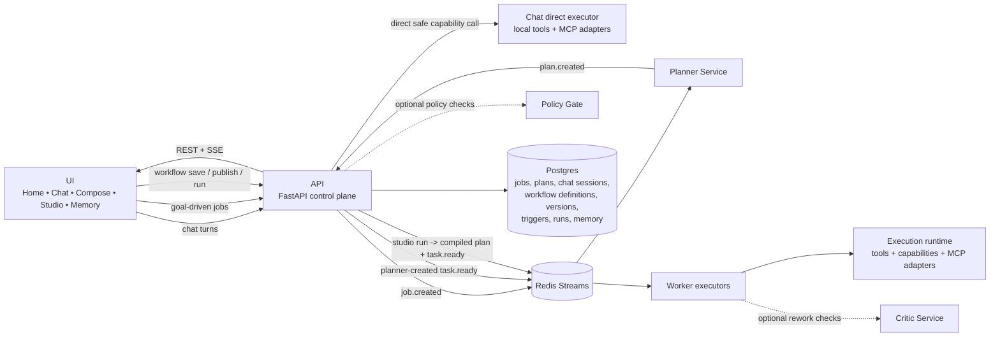

# Architecture

This document is the canonical architecture overview for Agentic Workflow Studio.
It explains the runtime model, service boundaries, execution paths, storage, and
how chat, planner-led jobs, and Studio-authored workflows fit together.

## 1. System Model

Agentic Workflow Studio is a hybrid execution platform with three primary lanes:

1. `Planner-led jobs`
   The user provides a goal. The API creates a job, the planner builds a typed
   task DAG, and workers execute ready tasks.
2. `Direct chat execution`
   Chat remains conversational by default and can execute a single safe
   read-only capability directly when durable orchestration is unnecessary.
3. `Studio-authored workflows`
   Users manually design workflows in Workflow Studio, save definitions, publish
   versions, and run them directly through triggers or explicit run requests.

All three lanes converge on shared runtime concepts:

- typed contracts
- job and task state
- tool and capability execution
- memory and context propagation
- event streaming
- artifact handling

## 2. High-Level Topology



If Mermaid is unavailable, the same flow is:

```text
UI -> API
  - chat can stay conversational or execute one safe direct capability
  - planner-led jobs emit job.created and are planned by the planner
  - Studio workflows are saved, published, and run directly from the API

API -> Redis Streams -> Worker executors
API -> Postgres for durable state
API -> UI through REST and SSE
Planner -> API with typed plans
Policy and Critic remain optional guardrail services
```

## 3. Control Plane and Data Plane

The platform is intentionally split into control-plane and data-plane concerns.

### Control plane

The control plane owns intent, orchestration, persistence, and lifecycle.

Main responsibilities:

- chat session handling
- job creation and job metadata
- workflow definition, version, trigger, and run lifecycle
- plan persistence
- event publication
- memory APIs
- artifact and workspace download endpoints

Primary service:

- `api`

Supporting services:

- `planner` for planner-led jobs
- optional `policy`
- optional `critic`

### Data plane

The data plane executes tasks and produces outputs.

Main responsibilities:

- tool execution
- capability execution
- task retries and DLQ handling
- memory-aware payload resolution
- artifact generation and optional object-store sync

Primary service:

- `worker`

Supporting runtimes:

- local tool runtime
- capability runtime
- MCP-backed adapters such as coder and GitHub backends

## 4. Core Services

### API

The API is the main control-plane entrypoint.

It owns:

- chat sessions and turns
- jobs, plans, tasks, and debugger views
- workflow definitions, versions, triggers, and runs
- memory read/write and semantic search
- composer compile and plan preflight
- artifact and workspace downloads
- SSE event streaming

The API also performs direct chat execution for a small allowlisted set of safe
capabilities and creates Studio workflow runs without involving the planner.

### Planner

The planner is responsible only for planner-led jobs.

It:

- consumes `job.created`
- builds a typed task DAG from a goal
- validates or repairs planner output in LLM mode
- emits a plan back to the API path for durable persistence and task dispatch

It is not part of the normal runtime path for Studio-authored workflows.

### Worker

Workers consume ready tasks from Redis Streams and execute them.

They handle:

- task execution
- retry policy
- stale pending recovery
- dead-letter publishing
- memory input loading and output persistence
- late binding of secret refs
- artifact sync to object storage in S3 mode

### Policy

The policy service is optional. It can consume task events and apply policy
decisions before or around task execution, depending on configuration.

### Critic

The critic service is optional. It exists to support review and rework loops for
tasks or outputs that require an extra quality check.

### UI

The UI is a Next.js application with multiple product surfaces:

- `Home`
- `Chat`
- `Compose`
- `Workflow Studio`
- `Memory`

It is a frontend over the API and SSE streams rather than a separate execution
engine.

## 5. Execution Paths

### 5.1 Planner-led jobs

This is the classic goal-to-plan-to-execution path.

Flow:

1. user submits a goal to `/jobs`
2. API creates a durable job
3. API emits `job.created`
4. planner consumes the event and builds a typed plan
5. API persists the plan and emits `task.ready`
6. workers execute ready tasks
7. API exposes state, results, artifacts, and events back to the UI

Use this lane for:

- goal-driven work
- multi-step orchestration inferred from user intent
- cases where planner decomposition is desirable

### 5.2 Direct chat execution

Chat is not forced through planner.

Flow:

1. user sends a chat turn
2. chat routing decides between:
   - conversational response
   - direct safe capability call
   - clarification
   - durable job creation
3. if a direct capability is chosen, the API executes it immediately
4. response is returned in chat without creating a workflow

Use this lane for:

- read-only lookups
- bounded single-step operations
- conversational guidance
- quick status and inspection actions

### 5.3 Studio-authored workflows

Workflow Studio is the explicit workflow authoring path.

Flow:

1. user authors a DAG in Studio
2. draft is compiled and preflighted
3. workflow definition is saved
4. a version is published with compiled plan data
5. runs are triggered directly from the API
6. the API creates the job and persists the supplied plan without planner
7. workers execute ready tasks

Use this lane for:

- manually designed workflows
- reusable and versioned DAGs
- trigger-driven automation
- workflows where deterministic author intent matters more than planner inference

## 6. Workflow Lifecycle Model

Workflow Studio introduces its own lifecycle objects:

- `WorkflowDefinition`
  Durable editable authoring object
- `WorkflowVersion`
  Immutable published version of a definition
- `WorkflowTrigger`
  Invocation configuration attached to a definition
- `WorkflowRun`
  Durable record tying a version invocation to the created job and plan

This is separate from planner-created jobs, though the execution runtime below
the plan/task level is shared.

## 7. State and Storage

### Postgres

Postgres stores durable control-plane state:

- jobs
- plans
- tasks
- chat sessions and messages
- workflow definitions
- workflow versions
- workflow triggers
- workflow runs
- memory entries

### Redis Streams

Redis Streams coordinate execution events.

Important streams include:

- `jobs.events`
- `plans.events`
- `tasks.events`
- `tasks.dlq`

Redis is used for asynchronous orchestration and retry/recovery behavior, not as
the source of truth for durable job or workflow state.

### Shared filesystem

Shared storage under `/shared` is used for:

- workspace files
- generated artifacts

In Kubernetes, multi-worker filesystem mode expects shared storage that supports
`ReadWriteMany`. In the local overlay, `/shared` is mounted from host storage.

### Object storage

Artifact handling supports optional S3-style backing storage.

In S3 mode:

- workers upload generated artifact files
- API artifact download falls back to object storage if local lookup fails

Workspace downloads remain shared-filesystem only.

## 8. Tools, Capabilities, and MCP Adapters

The platform separates raw tools from higher-level capabilities.

### Tools

Tools are concrete executable units registered through the tool runtime.

The tool bootstrap path is:

- `tool_catalog`
- `tool_plugins`
- `tool_governance`
- `tool_bootstrap`

Service-specific tool registries are assembled at runtime, then filtered through
governance and allowlists.

### Capabilities

Capabilities are higher-level, typed interfaces over tool backends and adapters.

They are used by:

- workers
- direct chat execution
- planner and Studio flows through compiled task bindings

Capability definitions live in `config/capability_registry.yaml` and can target:

- local tool execution
- MCP-backed services
- other adapter types

### MCP-backed services

Some capability backends are externalized behind MCP or MCP-like adapters, for
example:

- coder service
- GitHub MCP service

These are runtime backends, not first-class product surfaces.

## 9. Memory Model

Memory is user- and workflow-facing rather than a hidden internal-only feature.

Current memory categories include:

- structured memory such as `user_profile`
- semantic memory for searchable facts

Memory is available through:

- explicit memory APIs
- workflow bindings
- direct chat execution for allowlisted memory capabilities
- worker-time memory payload loading and persistence hooks

The active `user_id` can propagate from UI surfaces into chat, compose, and
Studio execution so user-scoped memory can be resolved without repeated manual
entry.

## 10. Reliability and Scaling

Worker reliability is built around Redis Streams consumer-group semantics.

Key runtime behaviors:

- retry policies such as `transient`, `any`, and `none`
- stale pending message recovery
- DLQ publishing to `tasks.dlq`
- manual task and job retry endpoints

Scaling options in Kubernetes:

- CPU-based HPA
- optional KEDA queue-depth scaling based on Redis Streams backlog

The worker path is intentionally the shared execution substrate for both
planner-led and Studio-authored workflows.

## 11. Observability

Observability is a first-class requirement.

### Metrics

Metrics surfaces exist across the deployed stack, including:

- API
- planner
- worker
- policy
- coder

### Tracing

OTLP tracing is supported through `OTEL_EXPORTER_OTLP_ENDPOINT`.

Today, worker explicitly configures OTLP export, and trace identifiers are also
propagated through runtime records that surface in the UI debugger.

### Optional observability stack

The repo includes an optional Kubernetes observability stack with:

- Prometheus
- Grafana
- Loki
- prebuilt dashboards

Jaeger is deployed separately in the base Kubernetes manifests.

## 12. Deployment Profiles

### Docker Compose

Docker Compose is the simplest local full-stack path.

Important constraints:

- planner and worker are fixed to OpenAI-backed LLM mode in Compose
- GitHub capabilities are not part of the default Compose workflow because
  `github-mcp` is not included there

### Local Kubernetes

The local overlay is the closest operational match to the intended deployment
shape.

It supports:

- local image build and pin workflow
- `.env`-driven config and secret sync
- shared `/shared` mounts for local development
- optional observability stack
- queue-depth scaling add-ons

## 13. Related Documents

- `README.md`
  High-level project overview and quickstart
- `docs/user-guide.md`
  End-user guide and playbook
- `docs/api.md`
  Endpoint-focused API guide
- `docs/semantic-memory.md`
  Memory model and usage
- `docs/attention-routing-architecture.md`
  Focused design doc for future attention-driven routing
