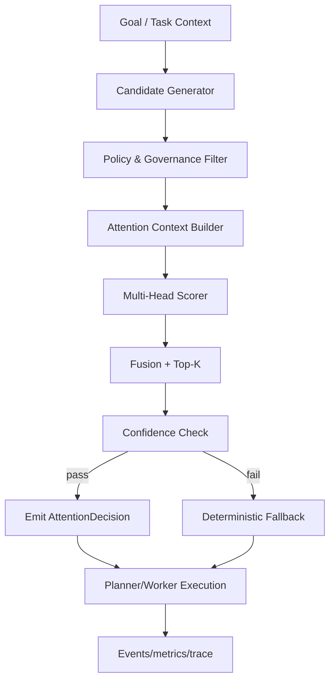

# Attention-Driven Routing Architecture for AWE

This document proposes a focused architecture to add attention-inspired decision logic to AWE
without replacing the existing plan-and-execute stack.

## 1) Problem to solve

- Planner routing is still mostly heuristic and deterministic.
- Tool/context selection can become noisy as the system adds more tools, capabilities, and MCP services.
- Poor routing increases retries, failed tasks, and latency from over-broad context injection.
- We need better selection quality with a safe fallback to current behavior.

## 2) Design intent

- Add attention only at two decision points:
  - `goal -> initial execution plan` inside planner.
  - `task -> tool/capability choice` inside worker.
- Keep all existing APIs, models, queues, and policies.
- Keep attention as a **reranker/mix-in**, not a full model replacement.

## 3) Positioning in the current architecture

Current flow (simplified):  
`UI -> API -> Redis Streams -> Planner -> Redis -> Worker -> Redis -> Critic/Policy -> API`.

Proposed insert points:
- `Planner` publishes a candidate DAG skeleton and invokes `attention_router` before final plan commit.
- `Worker` invokes `attention_router` before each executable step to choose the concrete tool/capability list.
- Both invocations emit scoring metadata for observability and fallback safety.

## 4) Components

### 4.1 Candidate Generator (existing behavior, unchanged)

Produces a small candidate set for attention to score:
- `k_plan_candidates` task templates from planner context.
- `k_tool_candidates` from tool registry, capability registry, and policy allow/deny checks.

### 4.2 Attention Context Builder

Builds compact vectors/features used by the router:
- Query/task embedding (from planner context and goal).
- Tool/capability embedding (name, docs, tags, historical stats).
- State/context embedding (recent task outcomes, tenant policy, cost constraints).
- Execution history embedding (e.g., last N successes/failures for this goal pattern).

### 4.3 Multi-Head Router Scorer

Computes scored relevance with multiple heads:
- Relevance head: semantic match to task text.
- Quality head: historical success, critic pass rate, error rate.
- Cost head: expected token/infra/runtime penalty.
- Recency head: how recently succeeded for same tenant/workload.

Each head produces a score per candidate.  
Final score = weighted, bounded sum (or softmax with temperature) with configurable weights.

### 4.4 Planner-Side Decision Service

- Input: goal context + candidate plan templates.
- Output: ordered plan candidate list + rationale tags.
- Emits structured artifacts:
  - `selected_candidates`
  - `candidate_scores`
  - `attention_entropy` (low entropy = confident routing).

### 4.5 Worker-Side Tool Selector

- Input: task context + ready-state + candidate tools/capabilities.
- Output: ordered tool/capability execution order + top-k chosen.
- Supports:
  - hard filtering by policy/gov before scoring.
  - hard constraints from critic or compliance.
  - deterministic fallback for confidence below threshold.

### 4.6 Routing Policy Layer

- Existing policy gate still enforces controls (unchanged).
- New router-level policies:
  - `ROUTER_ENABLED` (on/off).
  - `ROUTER_TOGGLE_FALLBACK=soft/hard`.
  - `ROUTER_MIN_CONFIDENCE` threshold.
  - `ROUTER_TOP_K`.
  - `ROUTER_HARD_BLOCK_LOW_CONFIDENCE`.

## 5) Data contracts

`AttentionCandidate`
- `candidate_id` (tool/capability/planner-template)
- `candidate_type` (`tool`, `capability`, `template`)
- `base_features`
- `policy_filters_applied`
- `head_scores`: map of `head -> score`
- `final_score`
- `confidence`
- `reason_code` (e.g., `top_semantic`, `policy_pref`, `history_penalty`, etc.)

`AttentionDecision`
- `decision_id`
- `request_id`
- `entity` (`planner` or `worker`)
- `selected_ids` (ordered list)
- `scores` (list)
- `fallback_used` (bool)
- `explainability`: top terms/tags/features used

## 6) Runtime topology (data flow)

```text
Planner/Worker Request
  -> Candidate Generator
  -> Policy/Governance Filter
  -> Attention Context Builder
  -> Multi-Head Scoring
  -> Decision Fusion + Top-K Select
  -> Fallback Check
  -> Planner/Worker Execution Choice
  -> Event + metrics publish to Redis/DB
```



## 7) Fallback and safety

- If `fallback_used=true`, execute existing deterministic path unchanged.
- If feature extraction fails, skip attention scoring and fallback.
- If candidate count is low, do not force attention; use deterministic order.
- Keep planner and worker parity: both emit same telemetry schema for auditability.

## 8) Observability

Track per decision:
- `attention_enabled`
- `candidate_count`
- `selected_rank_1_id`
- `attention_entropy`
- `fallback_count`
- `decision_latency_ms`
- `plan_quality_delta` (downstream critic/policy pass deltas)
- `retries_after_decision`

Add a correlation key through Redis event payload so API/Worker events and metrics can be joined by job/task.

## 9) Rollout plan

1. Stage 0: Telemetry-only mode  
   Log candidate scores without changing execution.
2. Stage 1: Planner shadow mode  
   Emit top-k + score ranking, compare against existing plan only.
3. Stage 2: Planner canary  
   Percentage-based enabling by tenant/job_type.
4. Stage 3: Worker canary  
   Tool selection is attention-reranked under canary constraints.
5. Stage 4: Full rollout with hard confidence gates.

## 10) Success criteria

- Decrease mean task retries and DLQ rate for selected job classes.
- Improve critic pass rate on first execution pass.
- Improve time-to-first-useful-artifact by lowering over-selection.
- No increase in latency above target SLO (e.g., +10% p95 for routing path).

## 11) Risks and mitigations

- **Risk:** attention overfits narrow historical patterns.  
  - Mitigation: recency decay and confidence floor.
- **Risk:** ranking suppresses deterministic best-practice paths.  
  - Mitigation: policy-first hard allowlist + deterministic fallback.
- **Risk:** extra latency.  
  - Mitigation: precompute embeddings, cache frequent candidates, strict p99 budget.
- **Risk:** explainability concerns.  
  - Mitigation: emit `reason_code` + head-score breakdown.

## 12) Open implementation questions

- Which embedding provider should be used in the first phase (mock, local, external API)?
- Should planner and worker routers share one model or use separate heads/weights?
- What confidence threshold is acceptable for no-fallback in low-risk environments?
