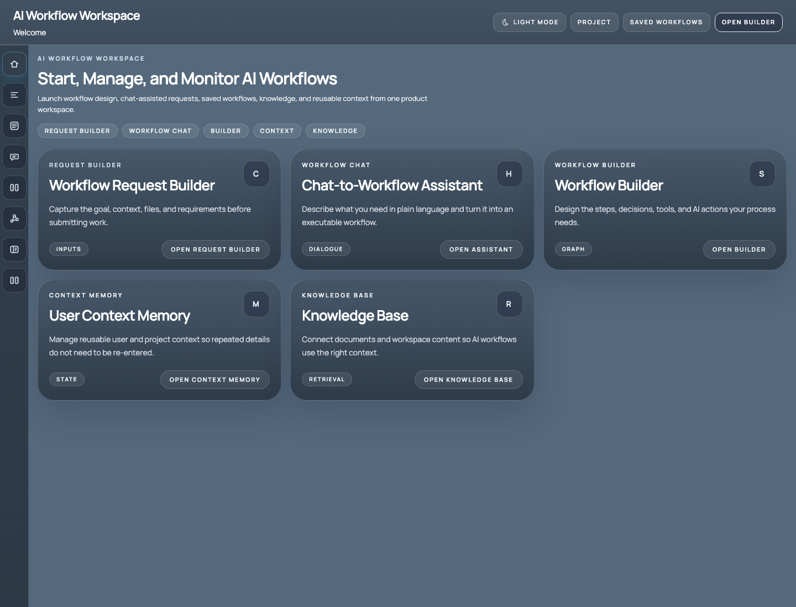
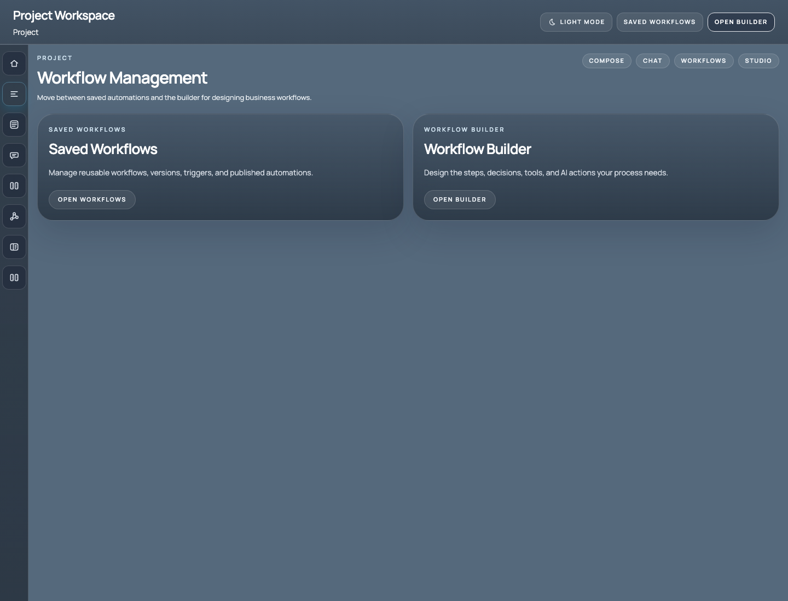
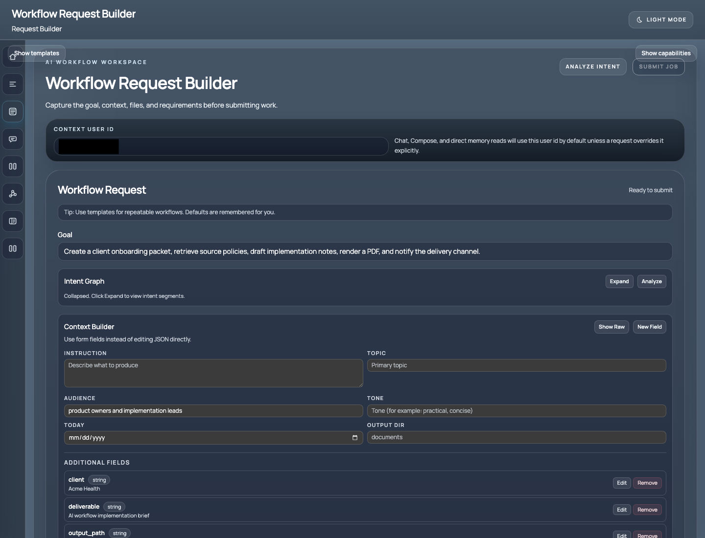
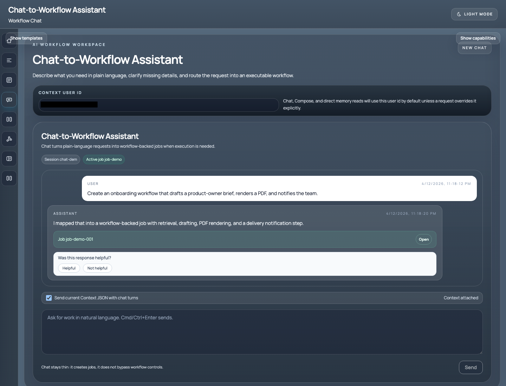
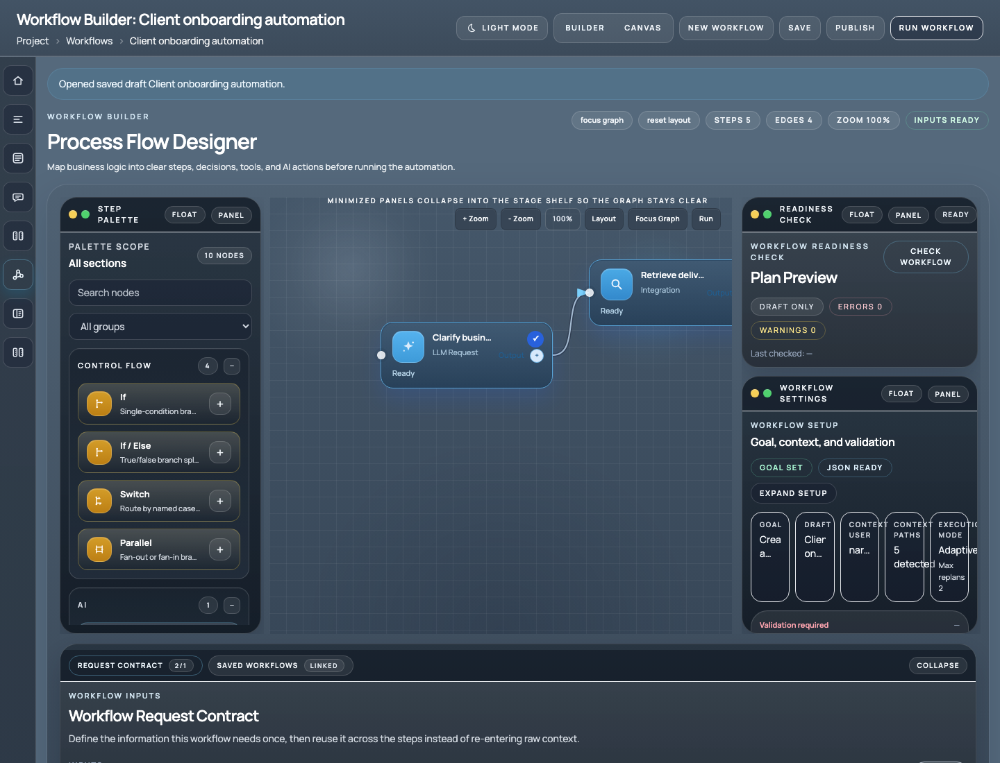
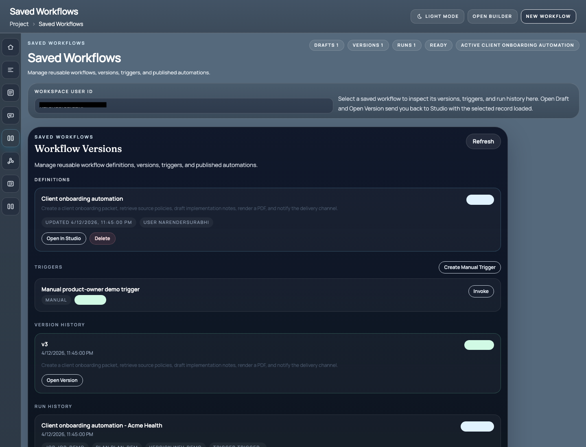
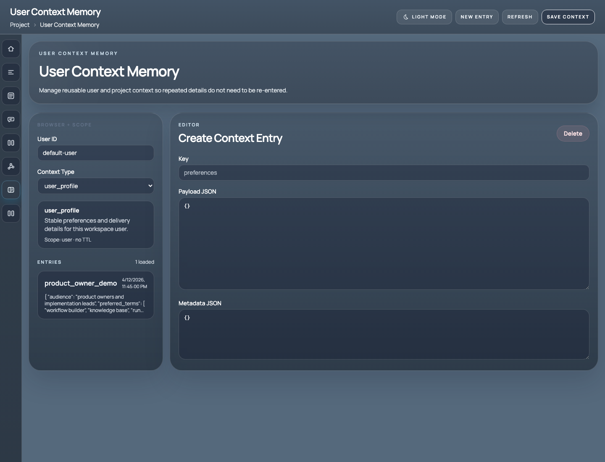
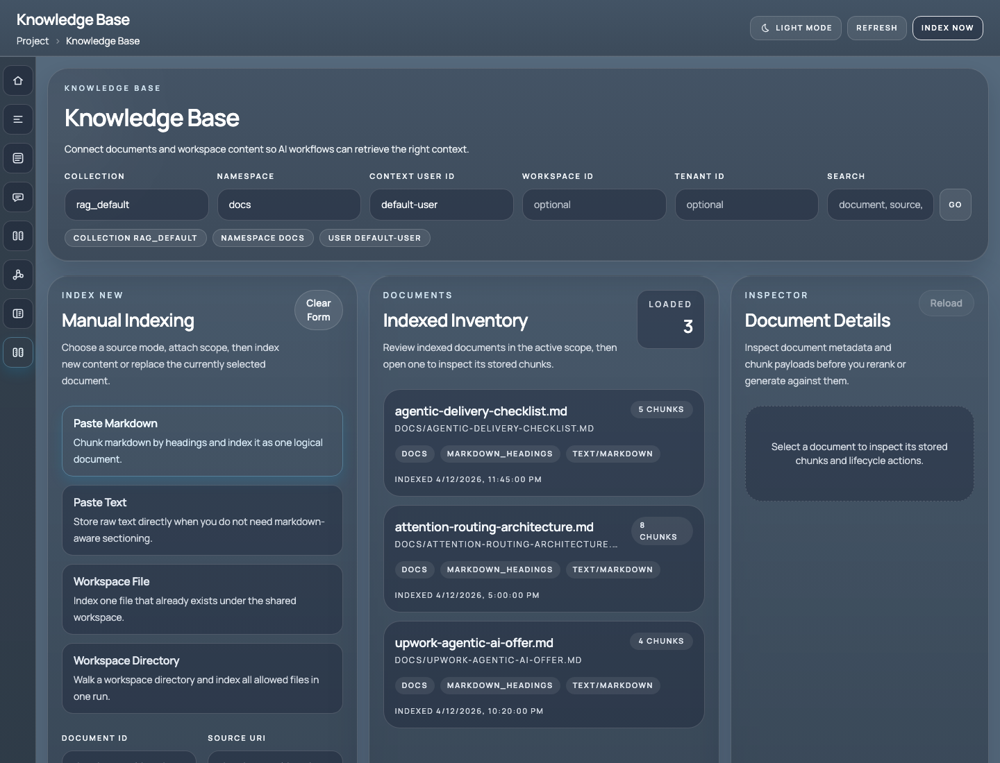

# Agentic AI Workflow Studio

Custom agentic AI workflow automation for teams that need more than a chatbot.

## Executive Summary

Agentic AI Workflow Studio is a configurable product foundation for organizations that want AI to complete structured business work across multiple steps, tools, documents, and decision points.

Instead of delivering a one-off prompt flow or a narrow chatbot, this product provides a working system for:

- collecting requests through structured forms or chat
- designing reusable workflows visually
- retrieving grounded knowledge from indexed content
- reusing customer and project context through memory
- executing multi-step runs with planner or workflow-driven logic
- monitoring workflow state, versions, and execution history

This is a strong fit for internal operations automation, onboarding flows, document pipelines, research assistants, support workflows, and other business processes that need repeatability, visibility, and room to grow.

## What Prospective Clients Are Buying

Clients are buying a product-ready AI workflow platform that can be tailored to their process, data sources, tools, and governance requirements.

The value is not just AI text generation. The value is the full working surface around it:

- a client-facing request and workflow experience
- a reusable workflow builder
- execution and orchestration services
- knowledge retrieval and context memory
- versioning, run history, and operational visibility

That means the delivered solution is easier to review, extend, and hand off than a greenfield prototype.

## Ideal Use Cases

This product fits clients who need AI to do structured work such as:

- client onboarding and implementation briefs
- support triage and escalation workflows
- research and document preparation pipelines
- internal copilots with grounded knowledge
- operations assistants that coordinate multiple tools
- repeatable workflow automation with business rules

It is especially valuable when a client needs:

- workflow repeatability
- human-readable interfaces
- configurable steps and decision points
- reusable context across runs
- run monitoring and version history
- a cleaner path from prototype to production

## Product Overview

The platform combines a frontend product experience with a backend execution foundation.

Core product areas include:

- AI Workflow Workspace
- Project Workspace
- Workflow Request Builder
- Chat-to-Workflow Assistant
- Workflow Builder
- Saved Workflows
- User Context Memory
- Knowledge Base

Together these surfaces support request intake, workflow design, execution, review, and ongoing improvement.

## Screenshots

### 1. AI Workflow Workspace

The main home surface gives users a clear entry point into request intake, workflow chat, builder access, context memory, and knowledge management.

### 2. Project Workspace

The project surface helps users move quickly between saved workflows and the workflow builder for ongoing business automation work.

### 3. Workflow Request Builder

This screen captures goals, context, and structured inputs before work is submitted. It is useful for teams that want more control than a free-form chat prompt.

### 4. Chat-to-Workflow Assistant

This screen lets users describe work in plain language and route it into a workflow-backed job when execution is needed.

### 5. Workflow Builder

The visual builder is where business logic becomes an executable workflow with steps, control flow, readiness checks, request contracts, and runtime settings.

### 6. Saved Workflows

This view supports reusable definitions, versions, triggers, and run history, which makes workflow operations easier to manage after initial delivery.

### 7. User Context Memory

This surface stores reusable user and project context so recurring work does not require the same setup on every request.

### 8. Knowledge Base

The knowledge screen supports document indexing and retrieval so workflows can use grounded context from business content.

## Key Capabilities

### Multi-Path Request Intake

Clients can choose the interaction model that fits their workflow:

- structured request forms
- chat-assisted workflow creation
- saved and reusable workflows

This gives teams flexibility without sacrificing execution consistency.

### Visual Workflow Design

The workflow builder supports explicit process authoring through a visual canvas. This is useful when stakeholders need to review how the AI system works before it runs.

That is a major selling point for product owners and operations teams because the workflow is visible, inspectable, and easier to govern.

### Knowledge Retrieval

The knowledge base supports indexed document retrieval so AI workflows can pull in grounded context instead of relying only on prompt text.

This is valuable for:

- policy-heavy environments
- implementation guidance
- internal knowledge workflows
- document and research pipelines

### User and Project Memory

Reusable memory helps persist details that should carry across requests and workflow runs. That reduces repeated setup and improves consistency for recurring work.

### Reusable Workflow Operations

Saved workflows, versions, triggers, and run history help clients manage the system after the initial implementation. This matters when the client wants a solution that can keep evolving instead of being replaced after a proof of concept.

## Technical Foundation

The platform is built as a full-stack product with a clear execution model.

At a high level, it includes:

- a Next.js frontend for the product UI
- an API control plane for jobs, workflows, runs, memory, feedback, and downloads
- planner and worker services for orchestration and execution
- typed execution contracts for steps and runs
- storage and event infrastructure for workflow state

This architecture supports several useful execution modes:

- planner-led jobs
- direct chat paths for safe simple tasks
- manually authored workflows that run directly from the studio path

That makes it flexible enough for both guided automation and more open-ended agentic execution patterns.

## Why This Sells Well to Clients

Most buyers do not want a research experiment. They want a usable system.

This product sells well because it addresses the practical concerns clients actually care about:

- how requests enter the system
- how workflows are reviewed and changed
- how context is grounded
- how repeat work stays consistent
- how runs are monitored
- how the solution can expand later

That is a much stronger offer than promising "an AI chatbot" without workflow structure, governance, or visibility.

## What a Typical Engagement Looks Like

### 1. Discovery

Define the business workflow, target users, required tools, knowledge sources, output expectations, and success criteria.

### 2. Initial Implementation

Configure the product, connect the required capabilities, and build the first end-to-end workflow path.

### 3. Hardening

Add retrieval, memory, validation, controls, and delivery polish so the workflow is more reliable and easier to operate.

### 4. Handoff

Deliver the configured implementation, screenshots, documentation, walkthrough, and next-step recommendations.

## What Clients Should Expect to Receive

Depending on scope, a typical delivery can include:

- configured product codebase
- tailored workflow implementations
- integrated request and chat surfaces
- knowledge and memory setup
- example runs and demo data
- screenshots and product documentation
- deployment notes
- backlog recommendations for next-phase features

## Best-Fit Buyer Profile

This product is best for:

- product owners
- operations leaders
- internal innovation teams
- technical founders
- teams building internal AI systems for structured work

It is less ideal for buyers who only need a simple landing page chatbot or a one-time prompt pack.

## Positioning Statement

I build custom agentic AI workflow systems for teams that need more than a chatbot. This platform provides a working foundation for request intake, workflow design, knowledge-grounded execution, reusable context, and multi-step automation. It is designed to help clients move from an idea or manual process to a system their team can operate, review, and expand over time.

## Call to Action

If you are evaluating this product for your business, the best next step is to define:

- the workflow you want to automate
- the documents or tools it depends on
- who will use it
- what a successful output looks like

From there, the platform can be tailored into a client-specific implementation plan.
